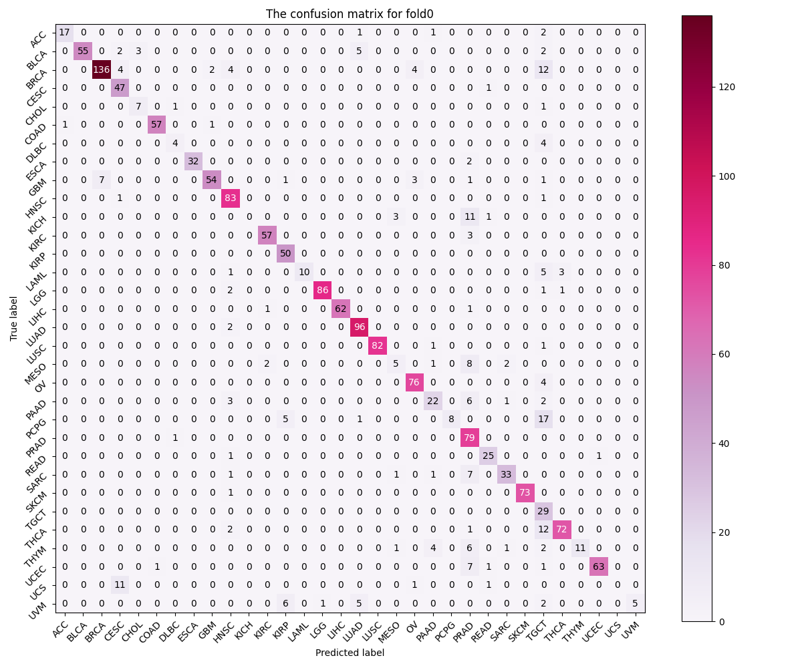
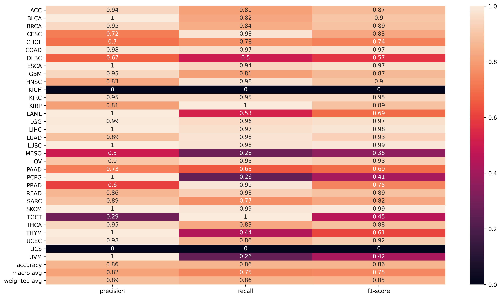
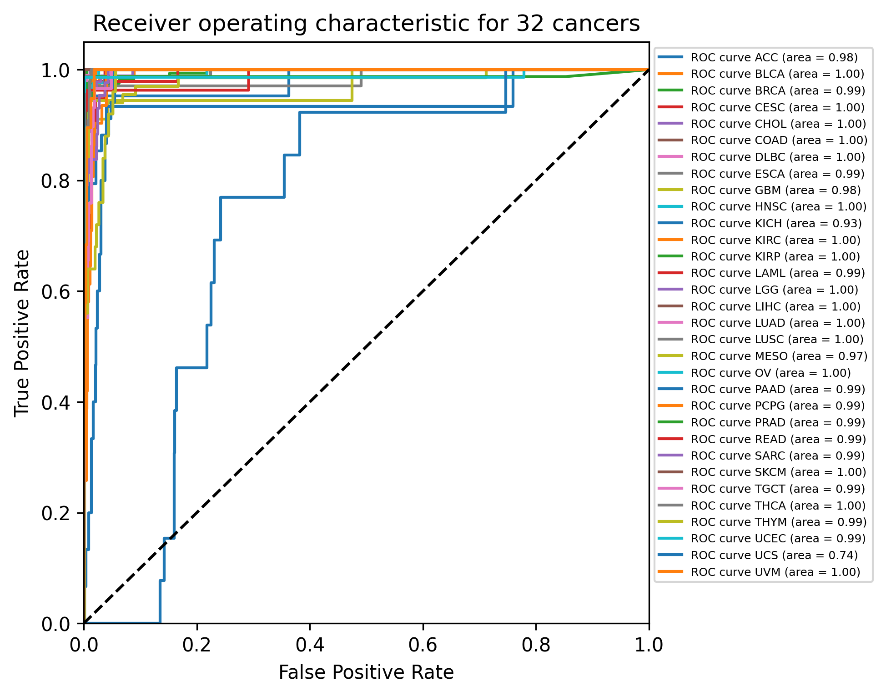
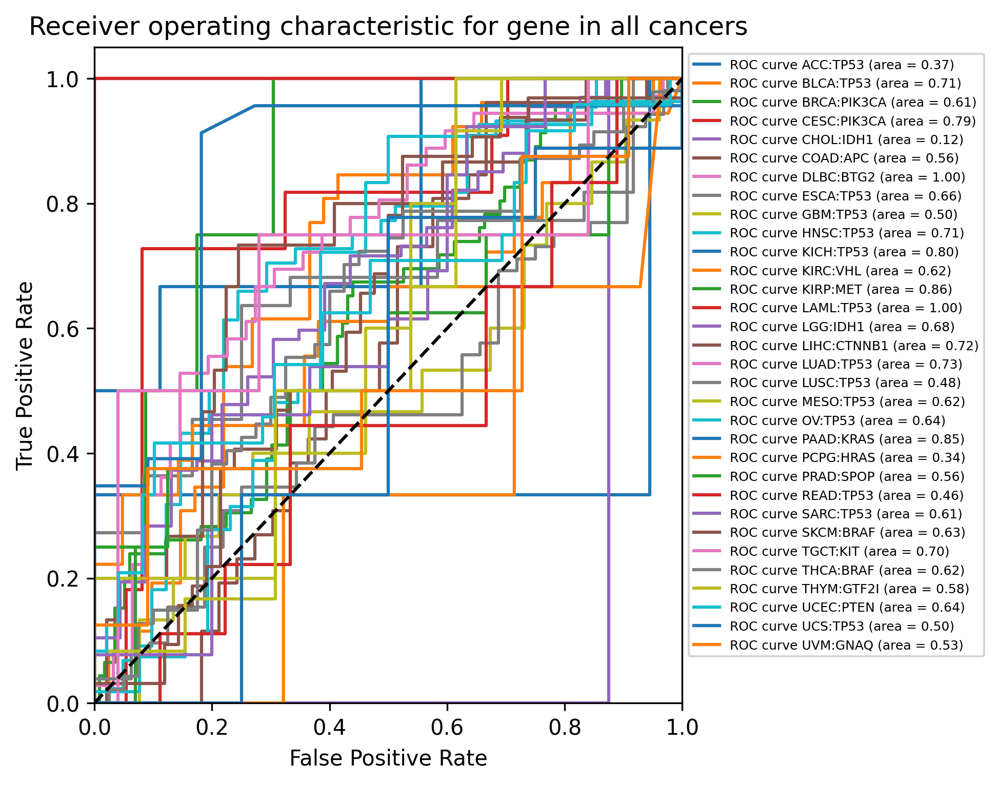

# Readme

## 1.Overall 

#### 1.1.This project is used to investigate on the feasibility of building a gene mutation status recommender system

**Note: _All the generated results and visualization file will be under specific result folder which is located under specific research folder_**
* we first tested the feasibility of using mutational signatures such as single based substitution signatures to identify cancers

* we then test the feasibility of using mutational signatures to validate the idea of predicting the gene mutation status for patients

#### 1.2.The Overall Repository Structure 

The whole repository contains: 

*  `data` -- store processed file and the R files to generate the processed file as well as the files for signature similarity visualizations

*  `dissertation` -- the file folder to store the dissertation related files 

*  `meeting-records` -- the meeting records

*  `presentation` -- contains the presentation video url and related files

*  `src` -- implementation of all of the experiment

*  `status_report` -- contains the status_report related files

*  `.gitattributes` -- listed the large files for uploaded to github

*  `.gitignore` -- listed the series of files to not upload to github

*  `manual.md` -- the user manual to run the experiments

*  `plan.md` -- used to display the plan for every week

*  `requirement.txt` -- used to store the required dependencies and libraries

*  `timelog.md` -- used to record the timelog for everyday working status

**Reminder:as the submission only contains data and src,The whole project can be find on github here:https://github.com/yangh567/level4-project

## 2.Build instructions

#### 2.1.Requirements

* Packages: listed in `requirements.txt` 
* Tested on Windows 10

#### 2.2.Build and evaluation steps

* Step1 : pip install -r requirements.txt
* Step2 : run the instructions in manual.md

